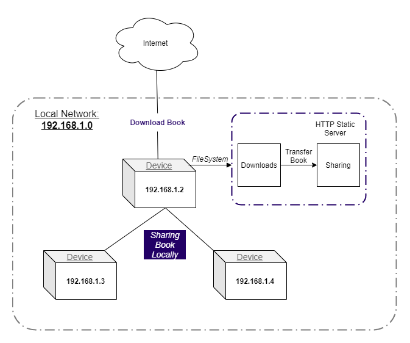

# **LeiturÁrvore** :books: :deciduous_tree:
> ### :globe_with_meridians: Incentive a leitura e o acesso á livros onde quer que esteja!

---

  

---

---

> O LeiturÁrvore é um projeto realizado no [MegaHack 3.0 da Shawee](https://www.megahack.com.br/) para o desafio da [Árvore Educação](https://arvoreeducacao.com.br/).

# :pushpin: Tabela de Conteúdos
- [Funcionalidades](#bulb-funcionalidades)
- [Conceito de Compartilhamento](#dart-conceito-de-compartilhamento)
- [Requisitos](#construction-requisitos)
- [Instalação](#white_check_mark-instalação)
- [Iniciando o projeto](#rocket-iniciando-o-projeto)
- [Tecnologias](#fire-tecnologias)
- [Time 62](#pray-time-62)
- [Contribuindo](#robot-contribuindo)
- [Licença](#scroll-licença)

# :bulb: Funcionalidades
- [X] :sunglasses: Registro de Usuário
- [X] :lock: Autenticação
- [X] :books: Listagem de Livros
- [X] :coffee: Feed Personalizado
- [X] :cloud: Modo Offline

# :dart: Conceito de Compartilhamento
Nessa seção tentaremos explicar como é possível compartilhar um livro no app sem estar conectado a internet.

Para que isso seja possível, uma pessoa precisa ao estar conectada á internet baixar o livro previamente.

A fim de compartilhar o livro já baixado é necessário estar conectado á uma rede local privada. Dessa forma, ao compartilha um livro o arquivo é transferido para a área de compartilhamento e um servidor HTTP estático é criado fazendo com que aquele dispositivo se torne o principal servidor daquele livro.

Veja o diagrama abaixo:

# :construction: Requisitos
- [X] Git
- [X] Node.js
- [X] AdonisJS CLI
- [X] React Native CLI
- [X] <s>Expo CLI</s>

# :white_check_mark: Instalação
Primeiramente confira se você possui todos requisitos acima e então clone este repositório:

- Via protocolo HTTP:
  - `git clone https://github.com/megahack3-62/leiturarvore.git`

- Via protocolo SSH:
  - `git clone git@github.com:megahack3-62/leiturarvore.git`
  
_Obs: Realize o clone via SSH somenete se você possuir uma chave SSH_

# :rocket: Iniciando o projeto
1. **Configure o diretório server, para iniciar o backend:** \
  Execute `cd server` para entrar no diretório server, em seguida:
    - Execute `npm install` para instalar as dependências.
    - Execute `cp .env.example .env` para copiar o arquivo de variáveis de ambiente e em seguida faça as devidas configurações. Nesse arquivo configure a váriavel IP_ADDRESS sendo o IP da sua máquina local _(Exemplo: 192.168.0.78)_ e insira o Token de acesso para utilizar a API da Árvore.
    - Execute `adonis migrate:run` para realizar as migrações no banco de dados.
    - Execute `npm run seed` para incluir registros essenciais no banco de dados.
    - E por último, execute `adonis serve --dev` para iniciar o servidor HTTP.
  
2. **Configure o diretório mobile, para iniciar o app mobile:** \
  Execute `cd mobile` para entrar no diretório mobile, em seguida:
    - Execute `npm install` para instalar as dependências.
    - Execute `cp .env.example env.js` para copiar o arquivo de variáveis de ambiente e em seguida faça as devidas configurações adicionando o IP e a Porta do seu servidor HTTP.
    - Execute `npm run android` para iniciar o app no android.
    - Execute `npm run start` para iniciar o package bundle do react native.

## :warning: O App foi ejetado do Expo. Você ainda pode executar via Expo CLI mas não é recomendado, ele pode conter alguns bugs inesperados.

### :warning: O App não foi testado no IOS. Ele pode conter alguns bugs inesperados.

_Obs: Caso queira, utilize o `yarn` invés do `npm`._

# :fire: Tecnologias
O projeto foi construído com:

- [Node.js](https://nodejs.org/en/) + [Adonis.js](http://adonisjs.com/)
- [React Native](https://reactnative.dev/) <s>+ [Expo](https://expo.io/)</s>
- [PostgreSQL](https://www.postgresql.org/)

_Obs: Caso queira mais praticidade, utilize um banco SQLite._

# :pray: Time 62
Conheça nosso time:

#### Desenvolvedores
- :octocat: [Anderson Alex Durante](https://github.com/andersonalexdurante)
- :octocat: [Breno C. Ribeiro](https://github.com/Brenin1991)
- :octocat: [Yuri Ziemba](https://github.com/yuziem14)

#### UX Designers
- :octocat: [Karol Goergen](https://www.behance.net/InovaDesignBR)
- :octocat: [Jonathan Z. Souza](https://www.behance.net/InovaDesignBR)

# :robot: Contribuindo
Leia o [Guia de Contribuição](CONTRIBUTING-pt.md).

# :scroll: Licença
Leia a [Licença](./../LICENSE.md) desse projeto.

---

> ### _Feito com :purple_heart: por Time 62_