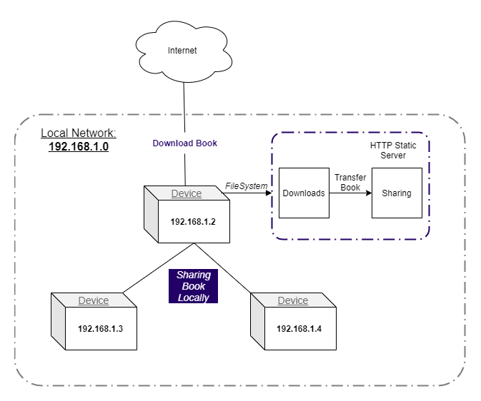

# **LeiturÁrvore** :books: :deciduous_tree:
> ### :globe_with_meridians: Encourage reading and the access to books wherever you are!

---

  

---

---

> LeiturÁrvore is a project developed in [MegaHack 3.0 from Shawee](https://www.megahack.com.br/) for [Árvore Educação's](https://arvoreeducacao.com.br/) challenge.

#### [Read the portuguese version.](./.github/README-pt.md)

# :pushpin: Table of Contents
- [Features](#bulb-features)
- [Share Concept](#dart-share-concept)
- [Requirements](#construction-requirements)
- [Installation](#white_check_mark-installation)
- [Quick Start](#rocket-quick-start)
- [Technologies](#fire-technologies)
- [Team 62](#pray-team-62)
- [Contributing](#robot-contributing)
- [License](#scroll-license)

# :bulb: Features
- [X] :sunglasses: User Registration
- [X] :lock: Authentication
- [X] :books: Books List
- [X] :coffee: Custom Feed
- [X] :cloud: Offline Mode

# :dart: Share Concept
In this section we will try to explain how the app can share a book even with no internet connection.

For make this possible a person needs to download the book when connected to the internet.
In order to share the downloaded book, it's necessary to be connected in a private network. When someone share a book, an static HTTP server is created turning the device in the new books server.

Take a look in the diagram below:

# :construction: Requirements
- [X] Git
- [X] Node.js
- [X] AdonisJS CLI
- [X] React Native CLI
- [X] <s>Expo CLI</s>

# :white_check_mark: Installation
First of all, check if you have all the requirements above and then clone this repository:

- Via HTTP Protocol:
  - `git clone https://github.com/megahack3-62/leiturarvore.git`

- Via SSH Protocol:
  - `git clone git@github.com:megahack3-62/leiturarvore.git`
  
_Obs: Only clone via SSH if you already have a secure SSH key._

# :rocket: Quick Start
1. **Config the server folder to run the backend:** \
  Run `cd server` to enter in the server folder, then:
    - Run `npm install` to install all the dependencies.
    - Run `cp .env.example .env` to copy the environment variables folder then config your environment. In this file set the IP_ADDRESS variable to be your local machine IP _(Example: 192.168.0.78)_ and set the access token to use the Árvore's API.
    - Run `adonis migrate:run` to migrate the database tables.
    - Run `npm run seed` to seed the database with required data.
    - Finally, run `adonis serve --dev` to start the HTTP server.
  
2. **Configure the mobile folder, to start the mobile app:** \
  Run `cd mobile` to enter in the mobile folder, then:
    - Run `npm install` to install all the dependencies.
    - Run `cp .env.example env.js` to copy the environment variables then config IP and PORT of your HTTP server.
   - Run `npm run android` to start the app on Android.
   - Run `npm run start` to start the react native package bundle.

## :warning: The App was ejected from Expo. You can still run via Expo CLI but is not recommended, it may contain some unexpected bug.

### :warning: The App was not tested on IOS. It may contain some bugs.

_Obs: If you want, use `yarn` instead of `npm`._

# :fire: Technologies
This project was build with:

- [Node.js](https://nodejs.org/en/) + [Adonis.js](http://adonisjs.com/)
- [React Native](https://reactnative.dev/) <s>+ [Expo](https://expo.io/)</s>
- [PostgreSQL](https://www.postgresql.org/)

_Obs: If you want, use SQLite instead of PostgreSQL to setup all easily._

# :pray: Team 62
Meet our team:

#### Developers
- :octocat: [Anderson Alex Durante](https://github.com/andersonalexdurante)
- :octocat: [Breno C. Ribeiro](https://github.com/Brenin1991)
- :octocat: [Yuri Ziemba](https://github.com/yuziem14)

#### UX Designers
- :octocat: [Karol Goergen](https://www.behance.net/InovaDesignBR)
- :octocat: [Jonathan Z. Souza](https://www.behance.net/InovaDesignBR)

# :robot: Contributing
Read the [Contributing Guidelines](CONTRIBUTING.md).

# :scroll: License
Read the [License](LICENSE.md) for this project.

---

> ### _Made with :purple_heart: by Team 62_